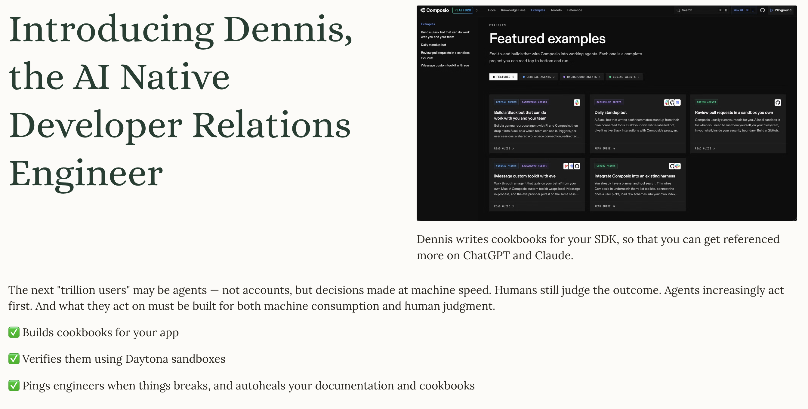
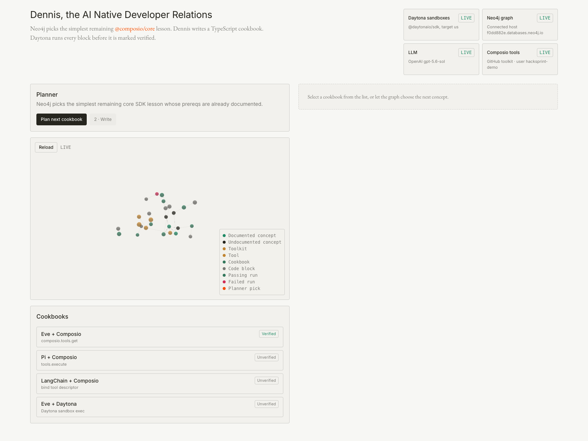
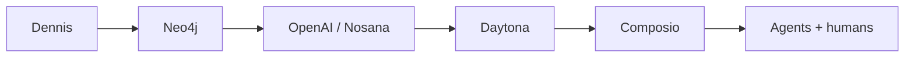
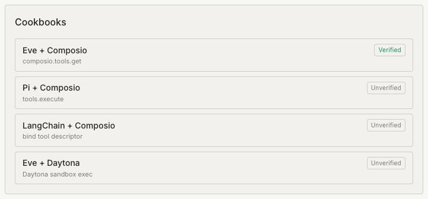
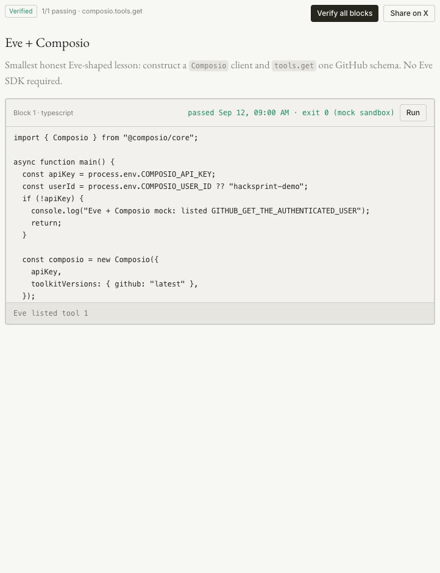

# Dennis, the AI Native Developer Relations



[Slides](https://gamma.app/docs/The-AI-Native-Developer-Relations-8v6kpoxjak6z5at?mode=present#card-uvnvr4m7av0wb0i)

Neo4j picks the simplest remaining `@composio/core` lesson. Dennis writes a TypeScript cookbook. Daytona runs every block before it is marked verified.



## Why

Agents are the next readers of SDK docs. If an example does not run, they ship the breakage. Dennis treats a cookbook as unpublished until every code block passes in a fresh sandbox.

## How it works

1. **Neo4j plans.** Seeded Composio concepts plus `PREREQ_OF` edges. `PLAN_CYPHER` picks the undocumented lesson whose prerequisites are already documented.
2. **OpenAI writes.** Strict Markdown: one H1, independently runnable TypeScript, PAT auth — no browser OAuth. Set `OPENAI_API_KEY` (default model `gpt-5.6-sol`). Without it, a deterministic mock author still produces a cookbook.
3. **Daytona verifies.** Each Run is a fresh TypeScript sandbox. Evidence is written back as `(:CodeBlock)-[:VERIFIED_BY]->(:Run)`. Verified only when every latest run passes.
4. **Composio is the first SDK.** The seed cookbooks teach `tools.get`, `tools.execute`, tool binding, and a nested Daytona exec against `@composio/core`.

The header tiles show **LIVE** vs **mock** per integration. Missing keys do not crash the app; they fall back and stay labeled.



[Open in Excalidraw](https://excalidraw.com) — drag and drop [`docs/dennis-stack.excalidraw`](docs/dennis-stack.excalidraw) onto the canvas. GitHub does not render `.excalidraw` files.

## Screenshots

Workbench, cookbook list, and one verified lesson:





## Seed cookbooks

| Cookbook | Lesson |
| --- | --- |
| Eve + Composio | Construct a `Composio` client and `tools.get` one GitHub schema |
| Pi + Composio | `tools.get` then `tools.execute("GITHUB_GET_THE_AUTHENTICATED_USER")` with a PAT |
| LangChain + Composio | Bind one GitHub tool descriptor and invoke it once |
| Eve + Daytona | Nested Daytona sandbox, `node --version`, then delete |

## Run

Requires Node.js 22. Boots on [http://localhost:4317](http://localhost:4317) with zero credentials.

```bash
npm install
cp .env.example .env.local   # optional
npm run dev                  # http://localhost:4317
```

```bash
npm run lint
npm run build
npm run start
```

See `.env.example` for Daytona, Neo4j, OpenAI/Nosana, and Composio. Do not commit `.env.local`.

| Integration | Live when | Mock fallback |
| --- | --- | --- |
| Daytona | `DAYTONA_API_KEY` | Deterministic static analysis, labeled `(mock sandbox)` |
| Neo4j | `NEO4J_URI` + `NEO4J_PASSWORD` | Process-memory graph |
| LLM | `OPENAI_API_KEY` (preferred) or `NOSANA_ENDPOINT` | Deterministic Markdown |
| Composio | `COMPOSIO_API_KEY` | Static GitHub tool descriptors |

Local Neo4j (optional):

```bash
docker run --name cookbook-neo4j \
  -p 7474:7474 -p 7687:7687 \
  -e NEO4J_AUTH=neo4j/cookbook-local-password \
  -d neo4j:5-community
```

```
NEO4J_URI=bolt://localhost:7687
NEO4J_USERNAME=neo4j
NEO4J_PASSWORD=cookbook-local-password
NEO4J_DATABASE=neo4j
```

Or point `NEO4J_URI` at Aura (`neo4j+s://…`). Do not set both.

Pre-UI Composio proof (keys stay in your shell, not the repo):

```bash
npx tsx scripts/composio-github-check.ts
```

## API

```bash
curl -s localhost:4317/api/status
curl -s localhost:4317/api/cookbook
curl -s -X POST localhost:4317/api/cookbook/plan
curl -s -X POST localhost:4317/api/cookbook/generate -H 'content-type: application/json' \
  -d '{"conceptId":"c-tool-calling","conceptName":"Give an agent GitHub tools"}'
curl -s -X POST localhost:4317/api/cookbook/run -H 'content-type: application/json' \
  -d '{"cookbookId":"<id>","blockId":"<id>-b0"}'
curl -s 'localhost:4317/api/graph/subgraph?limit=500'
```

`/api/graph/query` and `/api/sandbox/run` are foundation/debug routes. Do not expose them publicly without auth.
